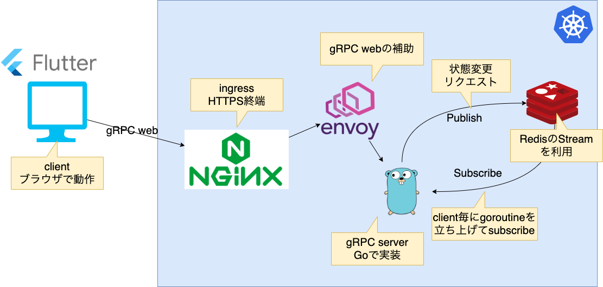

# porker-proto

This is porker protocol buffers.



## Related repositories
- https://github.com/swallowarc/porker-front
- https://github.com/swallowarc/porker-rpc

## Getting Started
Follow the steps below to get started.

### 1. Install Flutter and Go language

- Install Golang version 1.16 or higher in advance.
- Install Flutter. Refer to the [official website](https://flutter.dev/docs/get-started/install) for the detailed procedure.

### 2. Setup Tools

Execute the following command to install the required tools.

```shell
make setup/tools
```

### 3. Modify Protocol Buffers

Modify Protocol Buffers.

### 4. Generate gRPC codes

Use the following command.

```shell
make protoc
```
